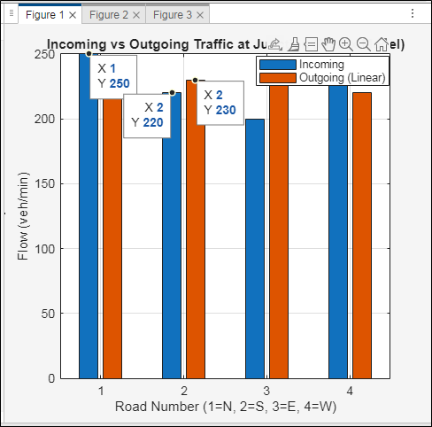
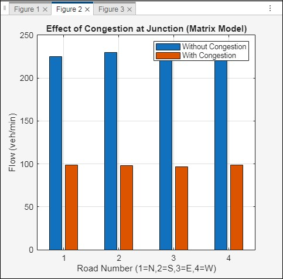
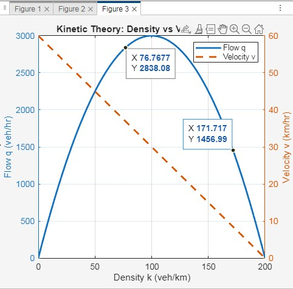

# Traffic-Flow-Balance-at-Road-Junctions
Traffic Flow Balance at Road Junctions using Matrix Formulation and Non-Linear Congestion Modeling

# 🚦 Traffic Flow Balance at Road Junctions  
### Computational Engineering Lab Case Study

---

## 📌 Aim

To model traffic flow balance at a four-way road junction using the principle of conservation of vehicles, formulate the system in matrix form, and compute traffic flows.  
The model also incorporates nonlinear congestion effects and kinetic theory concepts to improve realism.

---

## 📖 Problem Description

At a four-way intersection (North, South, East, West):

- Vehicles enter from each direction.
- Each vehicle may turn left, right, go straight, or take a U-turn.
- The redistribution of vehicles is represented using a turning ratio matrix.

The governing principle:

**Total Inflow = Total Outflow**

---

## 🧮 Mathematical Formulation

### 1️⃣ Matrix Model (Conservation Law)

Incoming traffic vector:

X_in = [N; S; E; W]

Turning ratio matrix:

X_out = T × X_in

Where:
- T = Turning ratio matrix
- Each column of T sums to 1
- Ensures conservation of vehicles

---

### 2️⃣ Nonlinear Congestion Effect

To model realistic traffic behavior:

F = X (1 - X / C)

Where:
- C = Road capacity
- Flow reduces as traffic approaches capacity

This introduces controlled nonlinearity into the system.

---

### 3️⃣ Kinetic Theory of Traffic Flow

Velocity-density relation:

v = v_max (1 - k / k_max)

Flow equation:

q = k × v

This produces the Fundamental Diagram of Traffic Flow, showing optimal density and congestion effects.

---

### 4️⃣ Numerical Simulation (Euler Method)

Time-dependent traffic variation is modeled using:

dx/dt = Inflow - Outflow

The system is solved numerically using Euler’s method.

---

## 📊 Results and Graphs

The MATLAB code generates:

- Incoming vs Outgoing Traffic comparison
- Congestion effect visualization
- Density–Velocity–Flow relationship
- Dynamic traffic evolution over time

### 🔹 1. Matrix Redistribution of Traffic

  

This graph compares incoming and outgoing traffic at the junction using matrix formulation.

---

### 🔹 2. Effect of Congestion

  

This graph shows how traffic flow decreases when congestion effects are introduced.

---

### 🔹 3. Kinetic Theory – Density vs Flow

  

This graph represents the fundamental diagram of traffic flow showing:
- Increasing flow at low density
- Maximum flow at optimal density
- Decreasing flow at high congestion

---
---

## 🛠 Concepts Used (Lab 1–5)

- Linear algebra (Matrix formulation)
- Conservation laws
- Nonlinear modeling
- Euler numerical method
- MATLAB plotting and simulation

---

## 📂 Repository Structure

Traffic-Flow-Balance/
│
├── traffic_flow_matrix_model.m
├── README.md

---

## 🎯 Conclusion

Traffic flow at road junctions can be effectively modeled using matrix-based conservation principles.  
Nonlinear congestion modeling enhances realism, while kinetic theory explains the density-flow relationship.  
Numerical methods allow simulation of dynamic traffic behavior.

⸻

->How to Run the Project
	1.	Open MATLAB
	2.	Copy the provided .m script
	3.	Run the file
	4.	Observe the resulta

⸻

⸻

Author

Rasesh J. Nair 
3rd year Mechanical Engineering Student
Computational Engineering Laboratory Project

⸻
